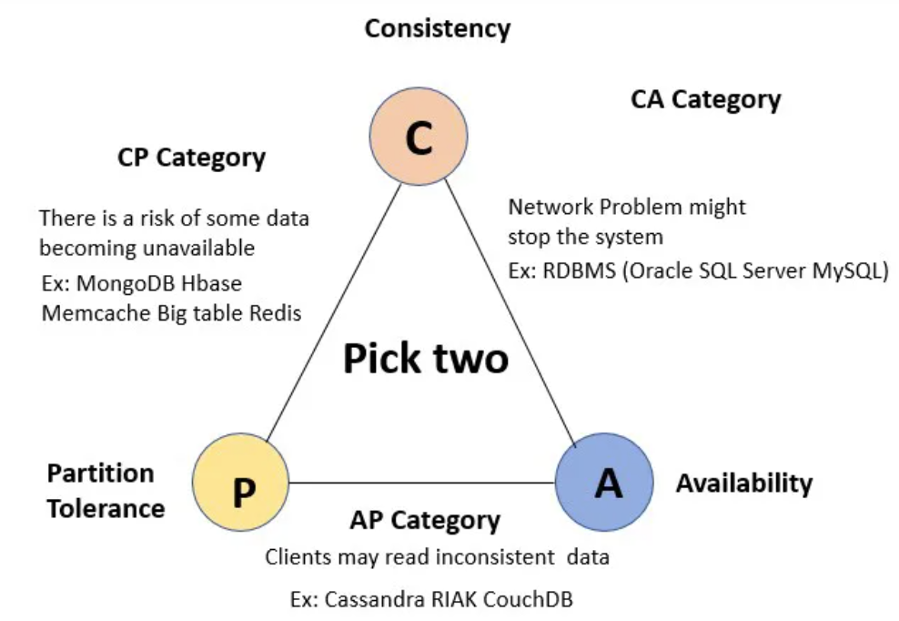

### What’s the difference between an ACID and a BASE database?
ACID and BASE are database transaction models that determine how a database organizes and manipulates data.   
In the context of databases, a transaction is any operation that the database considers a single unit of work.  
A transaction must complete fully for the database to remain consistent. For example, when you transfer money from one bank account to another, the money must leave your account and must be added to the third-party account. You cannot call the transaction complete without both steps occurring. 

### ACID compared with BASE
ACID and BASE are acronyms for different database properties representing how the database behaves during online transaction processing. 

### ACID 
ACID stands for atomicity, consistency, isolation, and durability.

#### Atomicity
Atomicity ensures that all steps in a single database transaction are either fully-completed or reverted to their original state. For example, in a reservation system, both tasks—booking seats and updating customer details—must be completed in a single transaction. You cannot have seats reserved for an incomplete customer profile. No changes are made to the data if any part of the transaction fails.

### Consistency
Consistency guarantees that data meets predefined integrity constraints and business rules. Even if multiple users perform similar operations simultaneously, data remains consistent for all. For example, consistency ensures that when transferring funds from one account to another, the total balance before and after the transaction remains the same. If Account A has $200 and Account B has $400, the total balance is $600. After A transfers $100 to B, A has $100 and B has $500. The total balance is still $600. 

### Isolation
Isolation ensures that a new transaction, accessing a particular record, waits until the previous transaction finishes before it commences operation. It ensures that concurrent transactions do not interfere with each other, maintaining the illusion that they are executing serially. For another example, is a multi-user inventory management system. If one user updates the quantity of a product, another user accessing the same product information will see a consistent and isolated view of the data, unaffected by the ongoing update until it is committed.

### Durability
Durability ensures that the database maintains all committed records, even if the system experiences failure. It guarantees that when ACID transactions are committed, all changes are permanent and unimpacted by subsequent system failures. For example, in a messaging application, when a user sends a message and receives a confirmation of successful delivery, the durability property ensures that the message is never lost. This remains true even if the application or server encounters a failure.

### BASE
BASE stands for basically available, soft state, and eventually consistent. The acronym highlights that BASE is opposite of ACID, like their chemical equivalents.

#### Basically available
Basically available is the database’s concurrent accessibility by users at all times. One user doesn’t need to wait for others to finish the transaction before updating the record. For example, during a sudden surge in traffic on an ecommerce platform, the system may prioritize serving product listings and accepting orders. Even if there is a slight delay in updating inventory quantities, users continue to check out items.

#### Soft state
Soft state refers to the notion that data can have transient or temporary states that may change over time, even without external triggers or inputs. It describes the record’s transitional state when several applications update it simultaneously. The record’s value is eventually finalized only after all transactions complete. For example, if users edit a social media post, the change may not be visible to other users immediately. However, later on, the post updates by itself (reflecting the older change) even though no user triggered it.

#### Eventually consistent
Eventually consistent means the record will achieve consistency when all the concurrent updates have been completed. At this point, applications querying the record will see the same value. For example, consider a distributed document editing system where multiple users can simultaneously edit a document. If User A and User B both edit the same section of the document simultaneously, their local copies may temporarily differ until the changes are propagated and synchronized. However, over time, the system ensures eventual consistency by propagating and merging the changes made by different users.

## CAP Theorem
The CAP theorem specifies that distributed systems can possess two of the following traits at any given time:
* Consistency
* Availability
* Partition tolerance

**Because partition tolerance is mandatory for databases storing massive datasets**, Cassandra and HBase differ in availability and consistency. 
* Cassandra/DynamoDB has high availability and partition tolerance because of its peer-to-peer node arrangement. 
* Hadoop/HBase provides consistency with partition tolerance because a single HBase primary replicates data to all nodes.

## Lets compare the read-write path of various Big Data Technologies

### HDFS

* To write a file in HDFS, a client needs to interact with master i.e. namenode (master).  
* Now namenode provides the address of the datanodes (slaves) on which client will start writing the data. 
* Client directly writes data on the datanodes, now the datanode will create a data write pipeline.
  * The first datanode while receiving data, will copy the block to another datanode, which in-turn will  copy it to the third datanode.
  * Once it creates the replicas of blocks, it sends back the acknowledgment.
* If a node fails during this process (or delays acknowledgement), the block will be under-replicated which will be taken care of later by the namenode.

* To read a file from HDFS, a client needs to interact with namenode (master) as namenode is the centerpiece of Hadoop cluster (it stores all the metadata i.e. data about the data).
* Now namenode checks for required privileges, if the client has sufficient privileges then namenode provides the address of the slaves where a file is stored.
*  Now the client will interact directly with the respective datanodes to read the data blocks.

### HBASE

* There is a special HBase Catalog table called the META table, which holds the location of the regions in the cluster.
* ZooKeeper stores the location of the META table.
* When the first time a client reads or writes to HBASE, the client gets the Region server that hosts the META table from ZooKeeper.
* The client will query the .META. server to get the region server corresponding to the row key it wants to access (read or write)
* The client caches this information along with the META table location. It will send the CRUD request to the corresponding Region Server.
* After the request is received by the right region server, 
  * the change cannot be written to a HFile immediately because the data in a HFile must be sorted by the row key. This allows searching for random rows efficiently when reading the data.
  * each change is stored in a place in memory called the memstore, which cheaply and efficiently supports random writes. Data in the memstore is sorted in the same manner as data in a HFile.
  *  When the memstore accumulates enough data, the entire sorted set is written to a new HFile in HDFS

### ZOOKEEPER
* Once a ZooKeeper ensemble starts, it will wait for the clients to connect.
* Clients will connect to one of the nodes in the ZooKeeper ensemble.
  * It may be a leader or a follower node.
  * Once a client is connected, the node assigns a session ID to the particular client and sends an acknowledgement to the client.
  * If the client does not get an acknowledgement, it simply tries to connect another node in the ZooKeeper ensemble.
  * Once connected to a node, the client will send heartbeats to the node in a regular interval to make sure that the connection is not lost.
* If a client wants to read a particular znode, it sends a read request to the node with the znode path and the node returns the requested znode by getting it from its own database.
  * For this reason, reads are fast in the ZooKeeper ensemble.
* If a client wants to store data in the ZooKeeper ensemble, it sends the znode path and the data to the server.
  * The connected server will forward the request to the leader and then the leader will reissue the writing request to all the followers.
  * If only a majority of the nodes respond successfully, then the write request will succeed, and a successful return code will be sent to the client. Otherwise, the write request will fail. The strict majority of nodes is called Quorum.

In order to achieve high read-availability, Zookeeper guarantees a weak-consistency over the replicates: a read can always be answered by a client node, and the answer returned may be a stale value (even a new version has been committed through the leader).  
Then it is the users' responsibility to decide whether the answer for a read is "stale-able" or not, since not all applications require the up-to-date information.   
So the following choices are provided:
1) If your application does not need up-to-date values for reads, you can get high read-availability by requesting data directly from the client.
2) If your application requires up-to-date values for reads, you should use the "sync" API before your read request to sync the client-side version with the leader.  
So as a conclusion, Zookeeper provides a customizable consistency guarantee, and users can decide the balance between availability and consistency.

It is worth mentioning that the zookeeper also stores a version-id with the znode data. If a client decides to overwrite the data, it can specify the version-id that it has seen, in the write request. The leader will reject the write request, if the version of the data that the client has seen, is an older version than what the leader has. This helps if the client misses a write between the sync request and write request.

### KAFKA
* Kafka Brokers handle read and writes. Each topic has one or more partitions, and each partition has a LEADER broker. 
* A Broker also forwards messages for replication.
* Each Broker also compacts its own logs replica (without influence to any other copies)
* Even when you have a replicated partition on a different broker, Kafka wouldn’t let you read or write from it because in each replicated set of partitions, there is a LEADER and the rest of them are just mere FOLLOWERS serving as backup. 
  * The followers keep on syncing the data from the leader partition periodically, waiting for their chance to shine.
  * When the leader goes down, one of the in-sync follower partitions is chosen as the new leader and now you can consume data from this partition.

### CASSANDRA
* In Cassandra, the cluster of nodes is stored as a “ring” of nodes and writes are replicated to N nodes using a replication placement strategy.
* When a client sends a write request to a single, random Cassandra node. 
  * The node who receives the request acts as a coordinator and writes the data to the cluster. 
  * It is the job of the Coordinator node to write the data to N nodes for redundancy and it will write the first copy to the primary node for that data, the second copy to the next node in the ring in another data centre, and the rest of the copies to machines in the same data centre as the proxy.
* When you write to a table in Cassandra (inserting data, for example), you can specify the write consistency level.
  *  The write consistency level is the number of replica nodes that have to acknowledge the coordinator that its local insert was successful (success here means that the data was appended to the commit log and written to the memtable). 
  * As soon as the coordinator gets WRITE_CONSISTENCY_LEVEL success acknowledgements from the replica nodes, it returns success back to the client and doesn't wait for the remaining replicas to acknowledge success.
  
* When a write request reaches a node, mainly two things happen:
  * The write request is appended to the commit log in the disk. This ensures data durability (the write request data would permanently survive even in a node failure scenario)
  * The write request is sent to the memtable (a structure stored in the memory).
  * When the memtable is full, the data is flushed to a SSTable on disk using sequential I/O and the data in the commit log is purged.

#### Cassandra Consistency
Cassandra offers several levels of consistency like ANY, ONE, QUORUM and ALL, for both reads and writes.   
In contrast, DynamoDB simplifies this to two configurable consistency levels for reads — eventual consistency and strong consistency. 

**For DynamoDB writes, the consistency level is not configurable at all.**  
Writes are always strongly consistent — every write is synchronously written to two replicas (2 AZs) and asynchronously written to one more. 
This ensures that any data are written is durable for the life of the datastore. 

